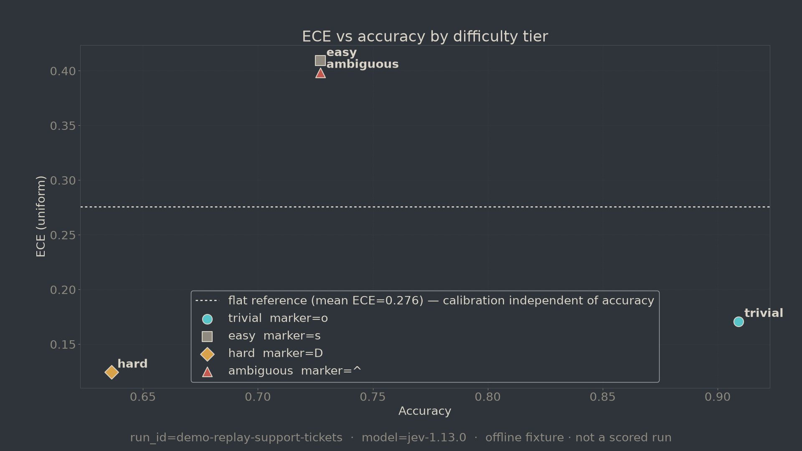

# jevbench

On the committed offline fixture (n=44 Jev items — **not** a scored live API
run), the OLS slope of uniform ECE versus tier accuracy is **−0.136**
(95% bootstrap CI **[−1.420, 0.841]**, 10 000 resamples, seed `20260919`).
The interval crosses zero: the harness check is inconclusive on whether
calibration tracks accuracy. Per-tier occupancy is required to read any ECE;
this pack validates the pipeline until EXP-1 scores against a locked dataset.



## How to verify offline

```bash
make install   # once
make reproduce # regenerates metrics + charts from committed JSONL
make check-repro
```

No API key. No network. Under two minutes. CI runs the same commands and
fails if any chart or metric in `results/` changes bit-for-bit
(`results/SHA256SUMS`).

Source records: [`runs/offline_fixture/raw.jsonl`](runs/offline_fixture/raw.jsonl).

## Method

- **Pre-registration:** [`PREREGISTRATION.md`](PREREGISTRATION.md) /
  [`preregistration.lock.json`](preregistration.lock.json) — hypotheses and
  dataset SHA-256 locked before scored calls.
- **Label guide:** [`datasets/support_tickets/LABEL_GUIDE.md`](datasets/support_tickets/LABEL_GUIDE.md)
  · disputed items: [`DISPUTED.md`](datasets/support_tickets/DISPUTED.md).
- **Pinned model:** `jev-1.13.0` (never `jev-latest` for scored numbers).
- **Serving path:** `native` (stated in the prereg).
- **Task / geography:** support-ticket routing labels
  (`billing` / `technical` / `other`), four difficulty tiers, English text.
- **Calibration:** probabilities / noul only — never Jev `confidence`
  (sharpness). ECE via netcal wrappers with mandatory occupancy
  (`jevbench.metrics`).

## Limitations

Write these down before anyone else does:

- **This README finding is an offline fixture**, including synthetic tier
  fillers for Arena occupancy demos. It is not EXP-1. Do not cite it as a
  Jev product claim.
- **n is small** (44 Jev rows in the fixture; 8 locked real tickets in the
  prereg dataset until the full EXP-1 pack lands). Bootstrap intervals are
  wide; occupancy in some bins is a handful of points.
- **Labels are author-assigned** with a written guide and a disputed file —
  not multi-annotator gold. Disputed items remain in the set and can move
  both accuracy and ECE.
- **Serving path is pinned to native.** Latency and cost numbers from other
  paths (OpenRouter, Vercel) are not interchangeable.
- **ECE without occupancy is meaningless** here: a single crowded bin can
  dominate. Charts and metrics always ship bin counts; treat empty high-
  confidence bins as a red flag, not a clean ECE.
- **Confidence ≠ calibration.** Using Jev `confidence` as a correctness
  probability is a category error; the metrics API raises `TypeError`.
- **Baseline in the fixture is simulated / adapter-shaped**, not a
  production Haiku/Flash invoice. Comparative accuracy deltas on this pack
  are harness smoke, not a model bake-off.
- **Arena Live is Demo — not scored.** Keys stay in memory; the UI cannot
  write scored `runs/<id>/`.
- **Chart bit-for-bit hashes are for Linux CI (Agg + DejaVu).** Local macOS
  PNG pixels may differ; `make check-repro` is authoritative on Ubuntu.

## Prior work

Existing Jev benchmarks — credit by name:

- [jev-baselines-eval](https://github.com/ickma2311/jev-baselines-eval) (ickma2311)
- [jev-phishing-bench](https://github.com/anisselbd/jev-phishing-bench) (anisselbd)
- [jev-rerank-bench](https://github.com/anessbelbati/jev-rerank-bench) (anessbelbati)
- [jev-benchmark](https://github.com/themsquared/jev-benchmark) (themsquared)
- [jev-exploration](https://github.com/SamuelSacco/jev-exploration) (SamuelSacco)

Related position / tools papers: Deferred Crispification (Zenodo 22801506),
Jev in Practice / daf-jev (Zenodo 22816188). Search log:
[`paper/RELATED_WORK.md`](paper/RELATED_WORK.md).

## Cost of the run

| What | USD |
|---|---|
| `make reproduce` (this repo, offline) | **$0.00** |
| Hypothetical replay of fixture tokens at snapshot `2026-09-19` | see `results/metrics.json` → `cost.hypothetical_live_usd_if_replayed` |
| Scored EXP-1 live API | not run yet — estimate with `jevbench run … --dry-run` first |

## How to extend it to your own data

1. Copy `datasets/support_tickets/` → `datasets/<your_task>/` and write a real
   label guide + disputed file.
2. Add `experiments/<exp>.yaml` pinning `jev-1.13.0` (or a newer **pinned**
   version) and the native serving path you will measure.
3. `jevbench preregister <exp>` → lock hashes **before** any scored call.
4. `jevbench run … --dry-run` → then the scored run; metrics stay offline.
5. Point `make reproduce` at your committed `runs/<id>/raw.jsonl` (or keep
   the offline fixture for CI and score separately).
6. Open a PR. See [`CONTRIBUTING.md`](CONTRIBUTING.md).

## Arena (replay instrument)

```bash
cd arena && python3 -m http.server 8765
# http://127.0.0.1:8765/
# ?chrome=off  — hide nav for capture
# ?slow=4      — baseline crawl 4× (badge on screen; disclose in VO)
```

Lab-instrument UI: [`arena/UI_SPEC.md`](arena/UI_SPEC.md). Shared tokens:
[`arena/tokens.json`](arena/tokens.json).

## Constitution (short)

- Harness is CLI + JSONL. Arena is replay-only for scored numbers.
- Calibration uses **netcal** / **MAPIE** — no hand-rolled ECE.
- Measure calibration on `probabilities` / `noul`, never on `confidence`.
- Pin `jev-1.13.0`. Log the resolved `model` field every call.

Full rules: [`CONSTITUTION.md`](CONSTITUTION.md). Cite:
[`CITATION.cff`](CITATION.cff). License: MIT.
