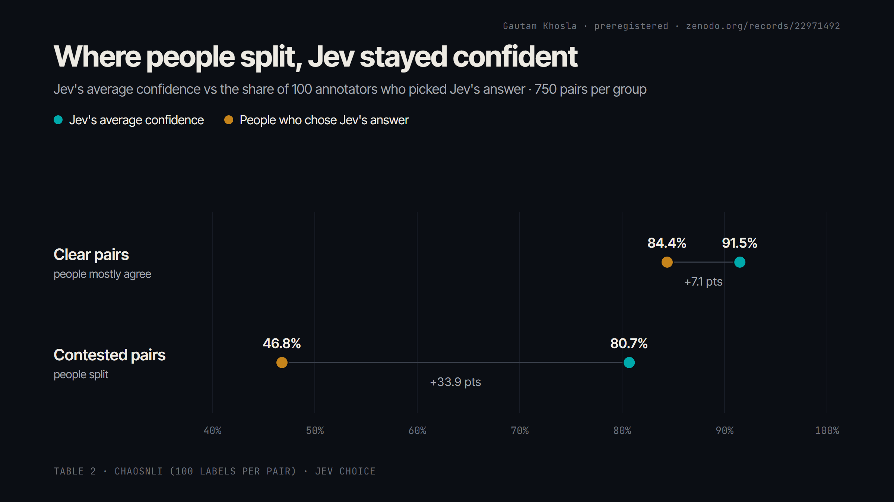
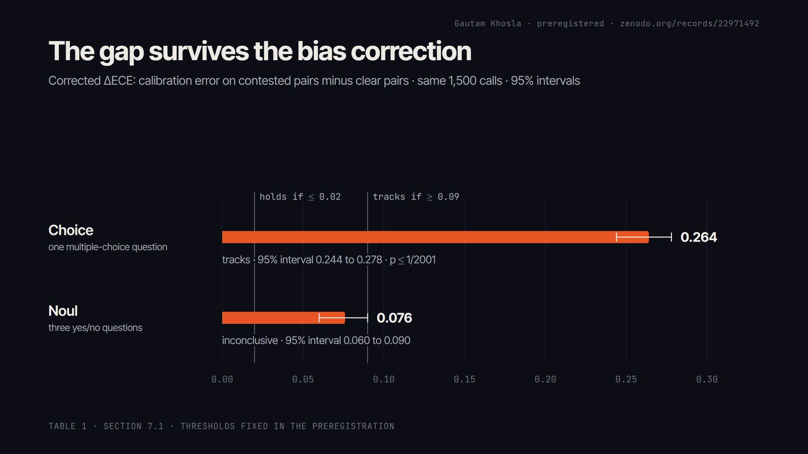
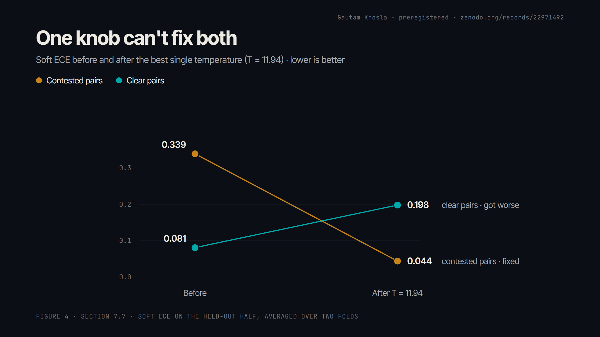
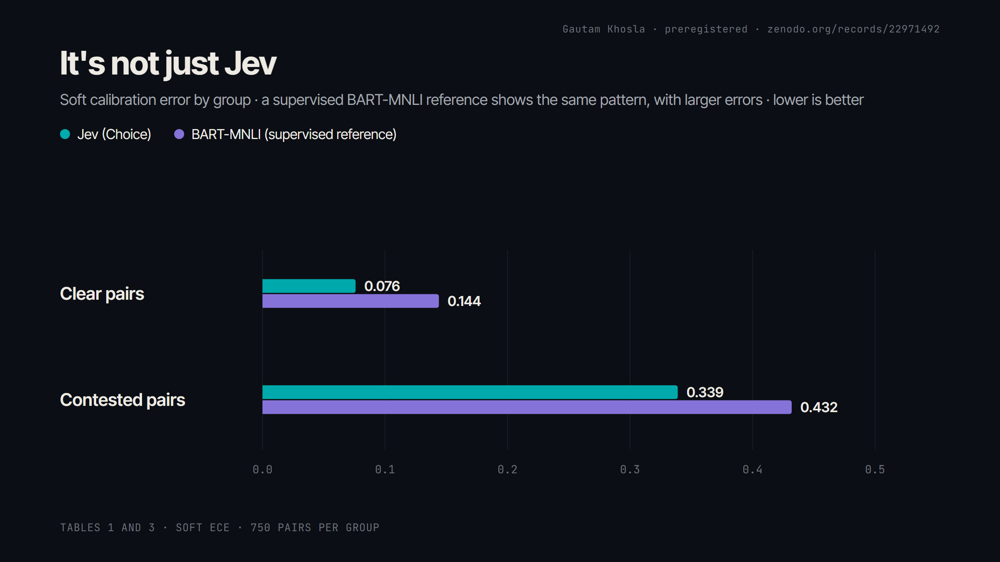

# Where people split, Jev stays 81% confident: a preregistered test of its calibration

*Plain-language summary of the paper. Every number here comes from the paper.*

*I tested TypeSafe's claim that Jev's probabilities are calibrated on the hardest kind of question: the ones people genuinely disagree about.*

Gautam Khosla · Computer Engineering, University of Ottawa · independent study

---

## The short version

- On 750 sentence pairs where people mostly agree, Jev was close to calibrated: 91.5% confident on average, with 84.4% of annotators picking its answer. Scored against the majority label, confidence and accuracy were 0.915 and 0.925.
- On 750 pairs where people split, Jev was **80.7% confident** on average while **46.8% of annotators** picked its answer.
- After a bias correction (explained below), the gap between the two groups is **0.264** (95% interval 0.244 to 0.278, p ≤ 1/2001). I fixed a threshold of 0.09 before collecting any data. This clears it.
- Jev's confidence still **ranks** which inputs are contested (AUROC 0.744). The signal is there; the scale is off.
- Asked the same question in Jev's other format (Noul), the gap was 0.076: **inconclusive**. I'm not rounding it up.
- One temperature (T = 11.94) fixes the contested pairs and breaks the clear ones.
- A supervised BART-MNLI reference shows the same pattern with larger errors. It's not just Jev.

Paper (latest version): https://doi.org/10.5281/zenodo.22971491 · Preregistration: https://zenodo.org/records/22971413 · Code, data hashes and every deviation: https://github.com/GautamTalksDev/jevbench · 11-minute video: https://www.youtube.com/watch?v=C6chAhTWvP4

---

## Why this question

TypeSafe describes Jev's outputs as calibrated probabilities. Most public tests so far have used coin flips, dice, or tasks with one correct label. Real inputs often don't have one correct answer: two careful people read the same sentence pair and disagree.

If a model's confidence is going to decide what software does automatically ("act if p ≥ 0.9"), the question that matters is simple. **When people genuinely disagree about an answer, does the model's confidence go down?**

## What I did

**Data.** ChaosNLI (Nie, Zhou and Bansal, EMNLP 2020): 3,113 natural language inference pairs, each labelled by 100 people. I took the 750 pairs with the lowest annotator entropy ("clear") and the 750 with the highest ("contested").

**Scoring.** Each prediction is scored against the share of the 100 annotators who picked Jev's label, not against a single majority answer. That is the soft calibration error.

**One test, fixed in advance.** Before any scored request, the preregistration fixed the metric, the verdict rule (tracks if the corrected gap is at least 0.09 with p < 0.05; holds if it is at most 0.02; inconclusive otherwise) and the analysis. Its SHA-256 hash was timestamped in the Bitcoin blockchain with OpenTimestamps, so nobody (including me) can pretend the plan came after the results.

**One trap.** Comparing calibration error between two groups is biased toward finding a difference. In a simulation of 100 perfectly calibrated models, the naive comparison flagged 1 in 10 as "worse on hard items" at a nominal 5% rate. With the bias correction the false-positive rate came back to 0.051. That correction was locked in before seeing any real data. It is a form of consistency resampling (Bröcker and Smith 2007; Vaicenavicius et al. 2019), extended with a Beta-Binomial model of annotator sampling.

**Everything is logged.** Every deviation from the plan is listed in the paper's appendix, including a bug in my BART client that I found, fixed and re-ran.

## Results

On clear pairs, confidence and agreement sit close together (+7.1 points). On contested pairs the gap opens to +33.9 points: Jev's confidence drops 11 points while agreement drops 38.

**Plot twist 1: same question, different answer.** Jev can be asked the same thing two ways: Choice (one multiple-choice question) or Noul (three yes/no questions). Choice shows the gap clearly. Noul lands at 0.076, between the thresholds, so the preregistered verdict is inconclusive. TypeSafe's own documentation says the two formats need not agree, and here they don't.

**Plot twist 2: the signal is actually there.** Use Jev's confidence to guess which pairs are contested and it works pretty well (AUROC 0.744). Confidence does go down where people split; just not nearly enough.

**Can you just fix it?** The obvious fix is temperature scaling: one number that rescales every probability. The best single setting (T = 11.94) takes contested pairs from 0.339 to 0.044 and clear pairs from 0.081 to 0.198. One knob, two problems.

**Plot twist 3: it's not just Jev.** A supervised BART-MNLI model, trained on exactly this task, shows the same pattern with larger errors in both groups. So this isn't a Jev-specific defect: a model built for exactly this task shows it too.

## What this means if you build with Jev

1. **Treat its confidence as a ranking of how contested an input is**, not as a probability you can take at face value on contested inputs.
2. **Set your thresholds on your own labelled data.** Calibration measured on someone else's distribution doesn't carry over automatically.
3. **Don't expect one global temperature to fix it.** It can fix contested inputs and break clear ones.

## Limits

One task (natural language inference), one dataset (ChaosNLI), one model version (jev-1.13.0). Newer versions might behave differently. This measures agreement with people, not some deeper truth. The Noul result is inconclusive.

## Disclosure

Independent study. Not affiliated with or endorsed by TypeSafe AI or the University of Ottawa. TypeSafe provided $5 of API credit; total spend was about $0.41. I sent the paper to TypeSafe before publishing. If you find an error, tell me and I'll correct it publicly.

*The example sentences in the video were written for the video, not taken from ChaosNLI.*
